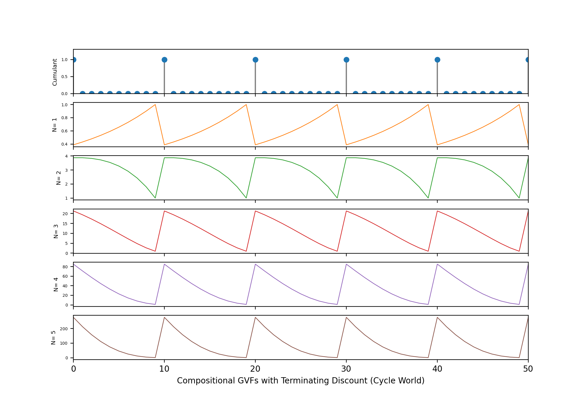

# CompositionalGVFs
This repository contains the code for Compositional GVFs on the Cycle World and Gridworld environments. 

We use TD(0) to learn the Compositional GVFs. In **Cycle World**, we use the observation as cumulant.

In **Gridworld**, we use the reward as cumulant to learn the first GVF. 

For a continuous environment, we use Mountain Car. This environment has a fixed solution, on which we learn the GVFs. 

## Reference
For more details refer to:
https://mkschleg.github.io/papers/schlegel2022predictions.pdf
